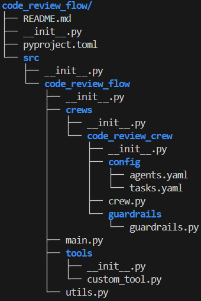
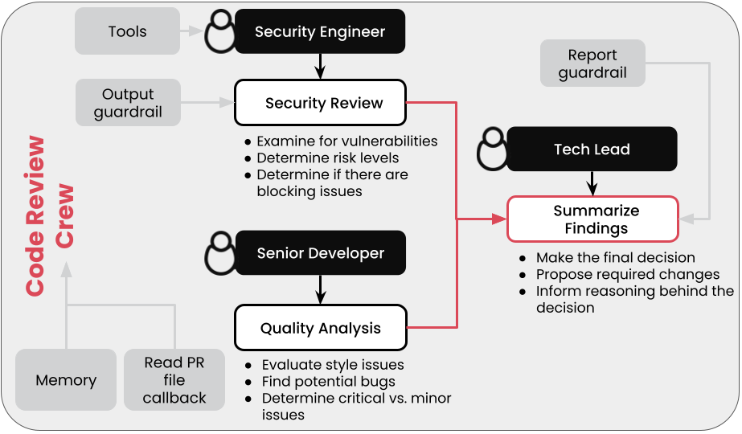
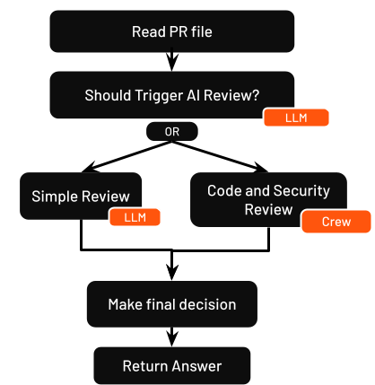

# Automatic Code Review Flow

## Background
Naturally, not all code changes warrant a full agentic review; sometimes it's small fixes, like indentation or fixing typos. In order to avoid wasting resources and time, you will create a Flow that analyzes the depth of the changes and deploys the Crew only if needed. You will also add some parallelism into the tasks of the Crew itself to make things more efficient. 
## Set up environment

Ensure you have Python >=3.10 <3.14 installed on your system. This project uses [UV](https://docs.astral.sh/uv/) for dependency management and package handling, offering a seamless setup and execution experience.

First, if you haven't already, install uv:

```bash
pip install uv
```

Next, navigate to your project directory and install the dependencies:

(Optional) Lock the dependencies and install them by using the CLI command:
```bash
crewai install
```

### Customizing

**Add your `OPENAI_API_KEY` into the `.env` file**

- Modify `src/code_review_flow/crews/code_review_crew/config/agents.yaml` to define your agents
- Modify `src/code_review_flow/crews/code_review_crew/config/tasks.yaml` to define your tasks
- Modify `src/code_review_flow/crews/code_review_crew/crew.py` to customize your crew
- Modify `src/code_review_flow/main.py` to customize your flow

## Folder structure

<div style="text-align: center;">

</div>


Here is a brief explanation of the role of each of the files and folders:
- `src/`: Contains all the files needed to define the flow
- `src/code_review_flow/crews/`: In here you can define as many crews as needed for your flow. In this case, you only have the `code_review_crew`
    - `src/code_review_flow/crews/code_review_crew/config`: This folder contains the [`agents.yaml`](code_review_flow/src/code_review_flow/crews/code_review_crew/config/agents.yaml) and [`tasks.yaml`](code_review_flow/src/code_review_flow/crews/code_review_crew/config/tasks.yaml) files. These help you configure the tasks and agents for the crew. 
    - `src/code_review_flow/crews/code_review_crew/guardrails/`: This folder contains the [`guardrails.py`](code_review_flow/src/code_review_flow/crews/code_review_crew/guardrails/guardrails.py) file, with the guardrails defined for the crew. 
    - [`src/code_review_flow/crews/code_review_crew/crew.py`](code_review_flow/src/code_review_flow/crews/code_review_crew/crew.py): This is the file where you create the crew, assigning it the agents, tasks, along with any additional configuration to these elements.
- [`src/code_review_flow/main.py`](code_review_flow/src/code_review_flow/main.py): In this file you will get to define the Flow object, inside which you will define all the tasks it needs to run, and interconnect them with the help of decorators.


## Crew structure

The crew has this structure:

<div style="text-align: center;">

</div>

## Flow structure
Flow diagram:

<div style="text-align: center;">

</div>

Let's do a little breakdown of each of these tasks:
1. The first task in the flow is in charge of reading the PR file with the code differences. This step replaces the before-kickoff hook you defined in the assignment from the previous module.
2. The next step consists of an LLM call to decide whether the changes are small or if a full analysis is needed. This is a router step, because it can select between two different routes.
3. Based on the decision:

    a. If the changes are simple enough, the Simple Review is executed, and an LLM call is used to decide whether the changes are good to be accepted or if other measures are needed.

    b. If the changes are more complex, the workload is delegated to the Crew for a deep analysis of the code and possible security issues.
4. However the PR was analyzed, the next step is to make the final decision. For this, the output of step 3 is passed to an LLM call to make the final decision.
5. After the final decision is made, an answer is returned to the user.

Flows allows you to define a state, which is the record of its current progress, inputs, intermediate outputs, and decisions made during execution. You can decide what messages, variables, or values you want to save there.


## Plot the Flow

Before actually running the Flow, it is nice to visualize the different steps as graph. This will help you verify that all the connections between the different methods are done correctly.

`! cd code_review_flow && crewai flow plot`

This will create an HTML file called `crewai_flow.html` inside the `code_review_flow` folder. 

## Run the Flow

`! cd code_review_flow && crewai run`


## Support

For support, questions, or feedback regarding the {{crew_name}} Crew or crewAI.

- Visit our [documentation](https://docs.crewai.com)
- Reach out to us through our [GitHub repository](https://github.com/joaomdmoura/crewai)
- [Join our Discord](https://discord.com/invite/X4JWnZnxPb)
- [Chat with our docs](https://chatg.pt/DWjSBZn)

Let's create wonders together with the power and simplicity of crewAI.
